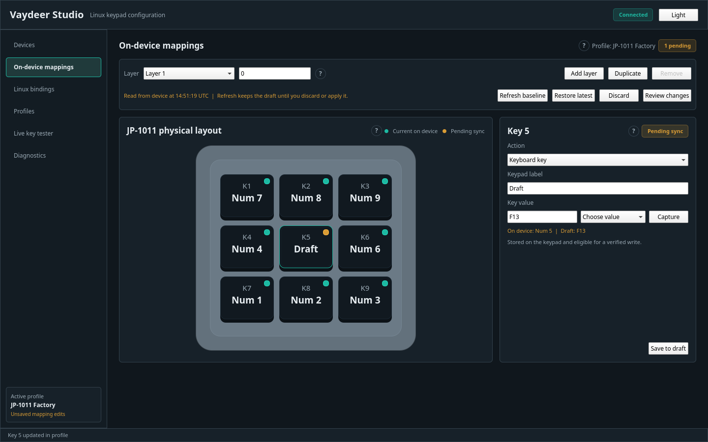

# Vaydeer Studio

Vaydeer Studio is a Linux-first desktop configurator for Vaydeer macro keypads.
It targets the Vaydeer JP-1011 nine-key keypad first, using a read-only HID
keepalive that makes its normal keyboard interface stay active on Linux. The
application separates portable onboard mappings from Linux-side actions,
creates a backup before every eligible write, previews the diff, and verifies a
write by reading it back.



## Why this exists

The JP-1011's normal keyboard reports can stop unless its vendor asynchronous
HID interface is held open. Opening the correct interface read-only is enough;
no vendor command, write, or read loop is required. Vaydeer Studio discovers
that interface dynamically rather than relying on a `/dev/hidrawN` number, and
keeps it open through a small user service.

## Features

- Device inspection, layers, layer names, and current mappings.
- A physical 3-by-3 JP-1011 editor with layer tabs and a diff review.
- Stable onboard single keys, modifiers, combinations, media/system keys, and
  disabled keys for the observed JP-1011 firmware `1.0.2` / bootloader `0.2.1`.
- Timestamped open JSON backups, restore staging, dry-run packets, and
  read-back verification.
- Portable JSON/YAML profiles and an XDG-backed profile library.
- Linux-side launch, URL, file, directory, command, notification, script, and
  software-text bindings handled by `vaydeer-studiod`.
- Mock JP-1011 mode for trying the complete interface without hardware.
- Live tester, diagnostics export, a scoped udev rule, desktop entry, MIME
  registration, and systemd user service.

## Supported devices

| Device / firmware | Read | On-device writes | Layout |
| --- | --- | --- | --- |
| JP-1011, firmware `1.0.2`, bootloader `0.2.1` | Yes | Stable basic mappings | Verified 3 by 3 |
| Same VID:PID, unknown firmware | Yes, guarded | Disabled | Detected key count |
| One-, four-, and six-key protocol variants | Adapter/layout scaffold | Disabled pending capture validation | Generic/provisional |

The project probes device type, subtype, firmware, and bootloader. It does not
assume public `1.1.2` firmware behaves like the observed `1.0.2` device.

## Safety

Firmware updating is intentionally absent. Command `0xFC` is rejected by the
protocol core and has regression tests proving it cannot be built. Unknown
commands are rejected too. Before any eligible configuration write, Vaydeer
Studio reads the device, checks capability, backs it up, creates a human
readable diff and packet preview, requires confirmation, commits, reads back,
and compares the result. The desktop UI will never write real hardware: use the
CLI's explicit terminal confirmation for a real write.

See [docs/safety.md](docs/safety.md) for the full boundary.

## Quick start

Mock mode is the fastest validated route:

```bash
uv sync --extra dev
uv run vaydeer-studio --mock jp1011
```

The current checkout was validated with `uv sync`, `pytest`, Ruff, mypy, the
source/wheel build, and an offscreen Qt smoke launch. For a physical keypad,
follow [docs/installation.md](docs/installation.md).

## Recommended installation

Install [uv](https://docs.astral.sh/uv/), clone this repository, then run:

```bash
uv sync --extra dev
./scripts/install.sh
# Reconnect the keypad after udev reloads its rule.
systemctl --user enable --now vaydeer-studio.service
vaydeer-studio
```

`install.sh` installs only user integration plus the narrowly scoped udev rule
for VID:PID `0483:5752` interfaces 0 and 2. It requires `sudo` only for that
one udev file. Do not run the desktop application as root.

### Ubuntu and Debian

Install a current Python 3.11+ and system HID library before using `uv`:

```bash
sudo apt install libhidapi-hidraw0 libegl1 libgl1
uv sync --extra dev
./scripts/install.sh
```

### Fedora

```bash
sudo dnf install hidapi libglvnd-egl mesa-libGL
uv sync --extra dev
./scripts/install.sh
```

### Arch Linux

```bash
sudo pacman -S hidapi mesa
uv sync --extra dev
./scripts/install.sh
```

Distribution package names can vary. The diagnostic screen reports the actual
permission and interface state when a command interface cannot be opened.

### AppImage, Debian package, and Flatpak

`make package` always builds the Python sdist and wheel. Reproducible AppImage,
Debian, and Flatpak scripts/manifests live in `packaging/`, but none of those
native artifacts was produced in this environment because `appimagetool`,
`dh-virtualenv`, and `flatpak-builder` were unavailable. The scripts report
their missing prerequisites rather than claiming a completed package.

### Source installation

Use the quick-start commands for a source checkout. The install script creates
`~/.local/bin/vaydeer-studio`, `~/.local/bin/vaydeer-studiod`, desktop/MIME
entries, and a user unit. `make run` is a mock-mode shortcut.

## First run

1. Connect the keypad and start `vaydeer-studio.service`.
2. Open **Devices** and confirm model, firmware, permissions, and keepalive.
3. Read mappings, select a layer/key, and edit a portable profile.
4. Use **Preview apply** to create a backup and inspect the diff.
5. For real hardware, run the displayed CLI command and type `APPLY` in the
   terminal after reviewing its backup path, mapping, diff, and packet list.

Every backup is versioned JSON under the XDG data directory, normally
`~/.local/share/Vaydeer Studio/backups`. Restore first stages that backup for
the same review flow.

## Linux-side bindings

Linux bindings deliberately live outside the keypad firmware. Add one in the
**Linux bindings** screen, save the profile, and let the user service handle
the vendor event. Commands use an executable plus argument array by default;
shell execution requires a profile-level explicit opt-in. These actions need
Linux and the running service, unlike stable onboard mappings.

## Troubleshooting

If normal key events disappear, check the service:

```bash
systemctl --user status vaydeer-studio.service
vaydeer-studio-cli diagnostics
vaydeer-studio-cli keepalive
```

Reconnect the keypad after installing the udev rule. See
[docs/troubleshooting.md](docs/troubleshooting.md) for permissions and HID
diagnostics, and export a sanitized diagnostic bundle from the app.

## Uninstall

```bash
./scripts/uninstall.sh
# Remove the udev rule as well:
./scripts/uninstall.sh --udev
```

Backups and profiles are retained deliberately.

## Development

```bash
make setup
make lint
make typecheck
make test
make build
make docs
```

Hardware tests are opt-in with `VAYDEER_HARDWARE_TESTS=1`; they never include
firmware commands. [docs/development.md](docs/development.md) explains the
mock transport and test layers. Contributions are welcome under
[CONTRIBUTING.md](CONTRIBUTING.md).

## Limitations

Mouse, macro, text, layer/Vaydeer-specific, host-trigger, and unknown vendor
assignments are modeled as experimental only. Their physical payload formats
are not sent because they cannot yet be safely round-tripped. Firmware flashing
and QMK replacement are out of scope. See [docs/device-support.md](docs/device-support.md)
and [docs/research](docs/research) for evidence and unknowns.

## License and acknowledgement

Vaydeer Studio is MIT licensed. It is an original implementation informed by
public projects and locally conducted research; no vendor binaries or copied
unlicensed source are included. See [LICENSE](LICENSE),
[ATTRIBUTION.md](ATTRIBUTION.md), and [docs/research/sources.md](docs/research/sources.md).
