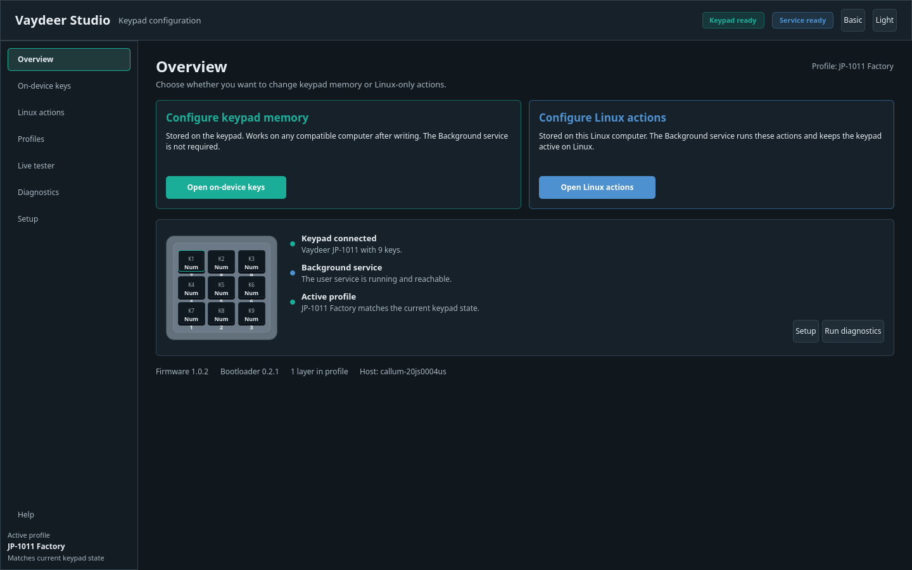
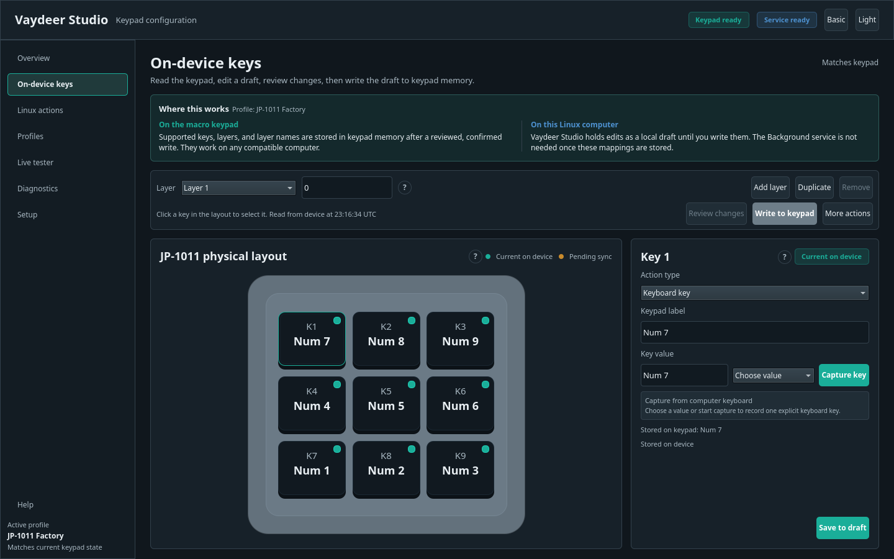
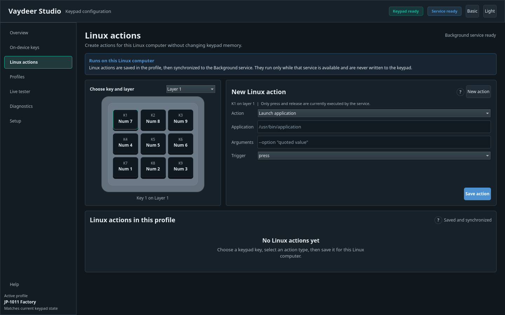
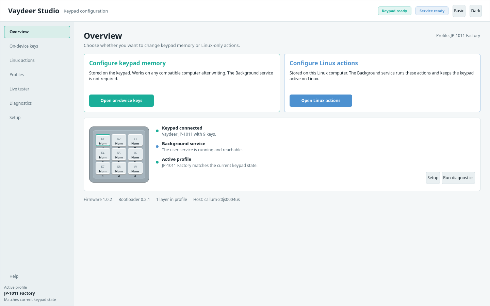

# Vaydeer Studio


[](https://github.com/callum-baillie/vaydeer-studio-linux/actions/workflows/ci.yml)
[](https://github.com/callum-baillie/vaydeer-studio-linux/releases)
[](LICENSE)

Vaydeer Studio is a Linux desktop configurator for Vaydeer macro keypads, with
first-class support for the JP-1011 nine-key keypad. It reads and edits onboard
mappings, keeps the stock keypad active on Linux, and runs optional Linux-only
actions through a small background service.

> [!IMPORTANT]
> Vaydeer Studio is an unofficial community project. It is not affiliated with,
> endorsed by, or supported by Vaydeer. Vaydeer product names and trademarks
> belong to their respective owners.

The project never flashes firmware. It backs up the keypad before every
eligible write, shows a human-readable review, requires explicit confirmation,
and verifies the result by reading it back.



<details>
<summary>More screenshots</summary>







</details>

## Install

Run this as your normal desktop user, not through `sudo`:

```bash
curl -fsSL https://github.com/callum-baillie/vaydeer-studio-linux/releases/latest/download/install.sh | bash
```

The installer detects Ubuntu/Debian, Fedora, Arch Linux, and common derivatives,
shows its plan, and asks before changing anything. It uses `sudo` only for
system libraries and the scoped udev rule. Studio, the CLI, and the Background
service are installed per user and never run as root.

Reconnect the keypad once after installation, then verify and launch:

```bash
~/.local/bin/vaydeer-studio-cli doctor
~/.local/bin/vaydeer-studio
```

If `~/.local/bin` is already on `PATH`, use `vaydeer-studio` directly. See the
[installation guide](docs/installation.md) to inspect or checksum the installer,
pin a release, skip host integration, or uninstall.

### Portable AppImage

The x86_64 AppImage bundles Python, Qt, and Vaydeer Studio. It does not install
the udev rule automatically; use **Setup** for the per-user Background service
and follow the permissions guidance for physical hardware. It expects the
standard Linux desktop runtime libraries listed in the installation guide.

```bash
curl -fLO https://github.com/callum-baillie/vaydeer-studio-linux/releases/latest/download/Vaydeer_Studio-x86_64.AppImage
chmod +x Vaydeer_Studio-x86_64.AppImage
./Vaydeer_Studio-x86_64.AppImage
```

### Build from source

Install [uv](https://docs.astral.sh/uv/getting-started/installation/), then:

```bash
git clone https://github.com/callum-baillie/vaydeer-studio-linux.git
cd vaydeer-studio-linux
uv sync --extra dev
uv run vaydeer-studio --mock jp1011
```

Run `./scripts/install.sh` from the checkout for full desktop, udev, and
Background service integration. Distribution dependencies and reproducible
build commands are in [docs/installation.md](docs/installation.md).

## What Runs Where

| Part | Where it runs or lives | Must Studio stay open? |
| --- | --- | --- |
| **Vaydeer Studio** | Visible desktop configuration app | No |
| **On-device keys** | Stored in keypad memory | No; they travel with the keypad |
| **Background service** (`vaydeer-studiod`) | Small per-user Linux service | No; it starts at login |
| **Linux actions** | Local profile data executed by the service | Studio: no; service: yes |
| **Profiles** | Portable JSON or YAML files on the computer | No |

The JP-1011's standard keyboard output can stop on Linux unless vendor HID
interface 2 is held open. The Background service discovers that interface by
VID/PID, interface number, usage page, usage, report descriptor, and sysfs
metadata. It opens the interface read-only and never relies on a fixed
`/dev/hidrawN` path.

## Capabilities

- Detect and inspect a connected JP-1011.
- Read device information, layer names, active layer, and current mappings.
- Edit the physical 3-by-3 keypad with current versus pending state markers.
- Write verified single keys, modifiers, combinations, media/system controls,
  disabled keys, layers, and layer names on the validated firmware.
- Preview a diff, create an XDG timestamped backup, confirm, write, and verify.
- Create, duplicate, import, export, and validate versioned profiles.
- Build Linux, macOS, and Windows-targeted portable mapping profiles.
- Start from Codex, ChatGPT, Photoshop, and Illustrator profile templates.
- Run Linux actions for applications, URLs, files, directories, commands,
  scripts, notifications, and supported software text behavior.
- Test physical vendor events without changing the keypad.
- Diagnose permissions, HID interfaces, service state, and device support.
- Demonstrate every screen without hardware using the JP-1011 mock.

## Device Support

| Device | Inspection | On-device writes | Layout |
| --- | --- | --- | --- |
| JP-1011, firmware `1.0.2`, bootloader `0.2.1` | Supported | Supported stable mappings | Verified 3 by 3 |
| Same VID:PID with unknown firmware | Guarded read-only | Disabled | Detected key count |
| One-, four-, and six-key protocol variants | Experimental adapters | Disabled | Generic/provisional |

Unknown firmware remains read-only because public firmware `1.1.2` has not
been assumed equivalent to the observed `1.0.2` device. The capability table
also checks VID, PID, reported type/subtype, key count, and bootloader.

See [device support](docs/device-support.md) for the exact compatibility
boundary.

## First Run

1. Open **Overview** to check the keypad and Background service.
2. Use **Setup** if permissions or the service need attention.
3. In **On-device keys**, select **Read from keypad** before editing.
4. Select a layer and key, choose a friendly action, and save the draft.
5. Use **Review changes**, then **Write to keypad**. A physical write requires
   typing `APPLY`; the backup and read-back verification remain mandatory.
6. Use **Linux actions** for host-only work such as launching an application.
7. Save or export the combined configuration from **Profiles**.

Selecting or saving a profile never silently writes it to the keypad. Profiles
can contain both portable onboard mappings and Linux-only actions, and the UI
labels those sections separately.

## Safety Guarantees

- Firmware command `0xFC` is blocked at the protocol boundary and covered by
  regression tests.
- Unknown command IDs and unknown assignment payloads are rejected.
- Firmware flashing, raw command consoles, command scanning, and bootloader
  changes are absent.
- Unknown firmware is read-only.
- Keepalive access is `O_RDONLY | O_CLOEXEC`; no keepalive read or write is
  required unless the Live tester is explicitly listening.
- Hardware writes require a current capability check, backup, review,
  confirmation, exclusive command session, and read-back comparison.

Read [the safety policy](docs/safety.md) before extending protocol code.

## Troubleshooting

If the keypad is visible over USB but keyboard events stop:

```bash
systemctl --user status vaydeer-studio.service
~/.local/bin/vaydeer-studio-cli doctor
~/.local/bin/vaydeer-studio-cli diagnostics --verbose
```

Reconnect the keypad after installing or changing the udev rule. Do not open a
guessed hidraw node or run a firmware updater. The [troubleshooting guide](docs/troubleshooting.md)
covers permission denial, service startup, reconnect recovery, read-only
firmware, and Live tester issues.

## Update and Uninstall

Update by rerunning the same one-line installer:

```bash
curl -fsSL https://github.com/callum-baillie/vaydeer-studio-linux/releases/latest/download/install.sh | bash
```

Updates replace the isolated application environment, refresh desktop files,
and restart the Background service. Profiles, backups, preferences, and keypad
mappings are preserved. The updater never writes keypad mappings.

To install or roll back to a specific release, replace `latest/download` with
`download/v1.1.0` in the installer URL. AppImage users can download the stable
filename again or use `appimageupdatetool`; update metadata is embedded in the
bundle.

From a source checkout:

```bash
git pull --ff-only
./scripts/install.sh
```

Uninstall from the repository or a release source archive:

```bash
./scripts/uninstall.sh
```

Use `./scripts/uninstall.sh --keep-udev` when another local tool still needs
the scoped rule. Profiles, backups, and diagnostics are retained deliberately;
their locations are documented in the [installation guide](docs/installation.md).

## Packages

Each release contains the one-line installer, Python wheel, source archive,
x86_64 AppImage with zsync update metadata, and `SHA256SUMS`. The installer is
the recommended cross-distribution path because it can configure the host udev
rule and user service safely. Native Debian, RPM, Arch, and Flatpak packages are
not claimed until they have independent build and integration testing. See
[packaging/README.md](packaging/README.md).

## Development

```bash
make setup
make lint
make typecheck
make test
make build
make package
make appimage
make docs
make install-smoke
```

Run the complete UI without hardware:

```bash
uv run vaydeer-studio --mock jp1011
```

Hardware tests are read-only, opt-in, and require
`VAYDEER_HARDWARE_TESTS=1`. See [development](docs/development.md),
[architecture](docs/architecture.md), and [contributing](CONTRIBUTING.md).

## Limitations

- Stable physical writes are limited to the validated JP-1011 firmware and
  documented mapping types.
- Mouse, onboard macro, onboard text, host-trigger, layer/Vaydeer-specific,
  and unknown vendor assignments remain experimental models and are never
  transmitted to hardware.
- Software text execution depends on an available desktop backend.
- Linux actions require this Linux machine and its running Background service.
- The application configures macOS/Windows-targeted portable profiles but runs
  only on Linux.
- Native distribution bundles are not yet supported.

## Research, Support, and License

The reverse-engineering record is preserved under [docs/research](docs/research)
with sanitized source reports under [research/sanitized-reports](research/sanitized-reports).
No vendor firmware, installer, extracted application, serial number, or private
host log is included.

Use [GitHub Issues](https://github.com/callum-baillie/vaydeer-studio-linux/issues)
for reproducible bugs and [SECURITY.md](SECURITY.md) for safety-sensitive
reports. Vaydeer Studio is MIT licensed. Public-source revisions, authors,
licenses, and clean-room decisions are recorded in [ATTRIBUTION.md](ATTRIBUTION.md).
